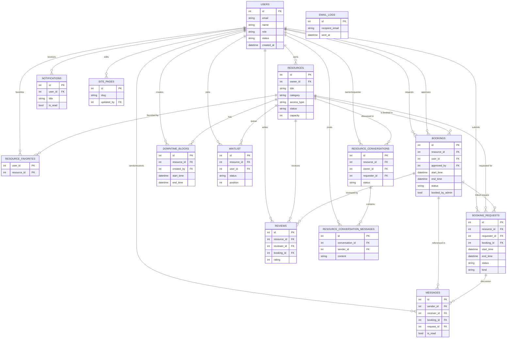

```markdown
# Entity–Relationship Diagram (ERD) — Hoosier Hub

## Overview
The Hoosier Hub data model supports IU’s campus resource scheduling workflow: users (students, staff, admins) own resources, submit bookings, manage waitlists, exchange messages, receive notifications, and maintain CMS pages (About/Contact). Supporting entities capture downtime, booking requests, reviews, favorites, and conversation threads so approvals and communications are auditable.

## Entities

**Table: users**  
- Primary key: `id`  
- Key fields: `name`, `email` (unique), `password_hash`, `role` (`student|staff|admin`), `status` (`active|inactive`), `department`, `profile_image`, `created_at`.  
- Purpose: Master record for every authenticated person; owners, requesters, approvers, editors, and message participants reference this table.

**Table: resources**  
- Primary key: `id`  
- Foreign keys: `owner_id` → `users.id`  
- Key fields: `title`, `description`, `category`, `capacity`, `location`, `image_url`, `access_type` (`public|restricted`), `status` (`draft|published|archived`), `available_slots`, timestamps.  
- Purpose: Campus assets that can be discovered and booked (study rooms, labs, equipment, tutoring sessions).

**Table: resource_favorites**  
- Composite PK: `user_id`, `resource_id`  
- Foreign keys: `user_id` → `users.id`, `resource_id` → `resources.id`  
- Purpose: Many-to-many join recording which resources a user has favorited.

**Table: bookings**  
- Primary key: `id`  
- Foreign keys: `resource_id` → `resources.id`, `user_id` → `users.id`, `approved_by` → `users.id`  
- Key fields: `start_time`, `end_time`, `purpose`, `booked_by_admin`, `status` (`pending|approved|rejected|cancelled|completed`), `rejection_reason`, `decision_at`, timestamps.  
- Purpose: Reservation records for resource/time slots and who approved them.

**Table: downtime_blocks**  
- Primary key: `id`  
- Foreign keys: `resource_id` → `resources.id`, `created_by` → `users.id`  
- Key fields: `start_time`, `end_time`, `reason`, `created_at`.  
- Purpose: Maintenance/unavailable windows that block bookings.

**Table: booking_requests**  
- Primary key: `id`  
- Foreign keys: `resource_id` → `resources.id`, `requester_id` → `users.id`, `booking_id` → `bookings.id`  
- Key fields: `start_time`, `end_time`, `purpose`, `note`, `status` (`pending|approved|denied|closed`), `decision_note`, `decided_at`, `kind` (`allocator|owner`), timestamps.  
- Purpose: “Book for me” or owner approval queue entries linked to eventual bookings.

**Table: reviews**  
- Primary key: `id`  
- Foreign keys: `resource_id` → `resources.id`, `reviewer_id` → `users.id`, `booking_id` → `bookings.id`  
- Key fields: `rating` (1–5), `comment`, `created_at`.  
- Purpose: Post-booking feedback tied to both the resource and specific booking.

**Table: notifications**  
- Primary key: `id`  
- Foreign keys: `user_id` → `users.id`  
- Key fields: `title`, `message`, `notification_type`, `is_read`, `related_url`, `created_at`.  
- Purpose: In-app notifications shown in the navbar bell (booking approved, request denied, etc.).

**Table: email_logs**  
- Primary key: `id`  
- Key fields: `recipient_email`, `subject`, `body`, `sent_at`.  
- Purpose: Audit trail for simulated emails (no FKs because emails may target non-users).

**Table: waitlist**  
- Primary key: `id`  
- Foreign keys: `resource_id` → `resources.id`, `user_id` → `users.id`  
- Key fields: `start_time`, `end_time`, `purpose`, `status` (`waiting|converted|rejected`), `position`, `notified`, `created_at`.  
- Purpose: Queue entries for full time slots; promotions create new bookings.

**Table: messages**  
- Primary key: `id`  
- Foreign keys: `sender_id` → `users.id`, `receiver_id` → `users.id`, `booking_id` → `bookings.id`, `request_id` → `booking_requests.id`  
- Key fields: `subject`, `content`, `is_read`, `created_at`.  
- Purpose: Direct messages tied to bookings or booking requests.

**Table: resource_conversations**  
- Primary key: `id`  
- Foreign keys: `resource_id` → `resources.id`, `owner_id` → `users.id`, `requester_id` → `users.id`  
- Key fields: `status` (`open|closed`), timestamps.  
- Purpose: Persistent conversation thread per resource + requester.

**Table: resource_conversation_messages**  
- Primary key: `id`  
- Foreign keys: `conversation_id` → `resource_conversations.id`, `sender_id` → `users.id`  
- Key fields: `content`, `created_at`.  
- Purpose: Messages inside the above conversations.

**Table: site_pages**  
- Primary key: `id`  
- Foreign keys: `updated_by` → `users.id` (nullable)  
- Key fields: `slug`, `title`, `body`, `updated_at`.  
- Purpose: CMS entries for About/Contact content editable by admins.

## Relationships
- `users` 1–* `resources` (owner_id).
- `users` 1–* `bookings` (user_id); `users` 1–* `bookings` via `approved_by`.
- `resources` 1–* `bookings`.
- `users` *–* `resources` via `resource_favorites`.
- `resources` 1–* `downtime_blocks`; `users` 1–* `downtime_blocks` (created_by).
- `users` 1–* `booking_requests`; `resources` 1–* `booking_requests`; each request optionally links to a single booking.
- `resources` 1–* `reviews`; `users` 1–* `reviews`; `bookings` 1–* `reviews`.
- `users` 1–* `notifications`.
- `resources` 1–* `waitlist`; `users` 1–* `waitlist`.
- `users` 1–* `messages` (sender/receiver); `bookings` 1–* `messages`; `booking_requests` 1–* `messages`.
- `resources` 1–* `resource_conversations`; each conversation connects owner + requester (`users`).
- `resource_conversations` 1–* `resource_conversation_messages`.
- `users` 1–* `site_pages` (updated_by).

## Mermaid ER Diagram


```

